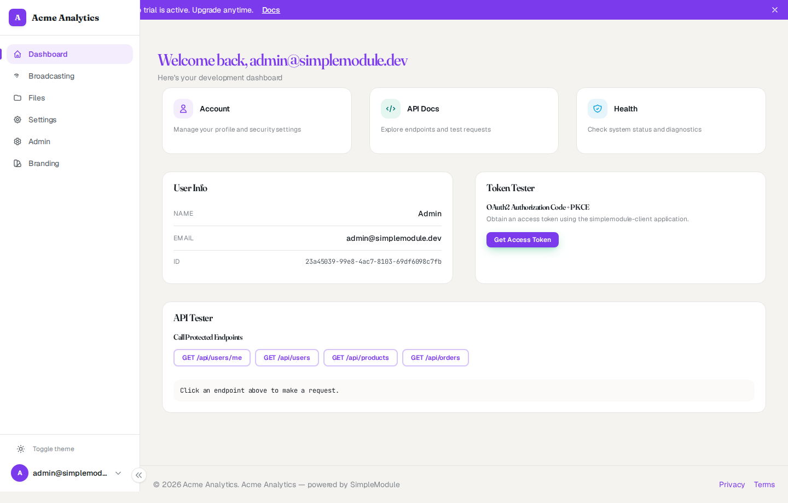
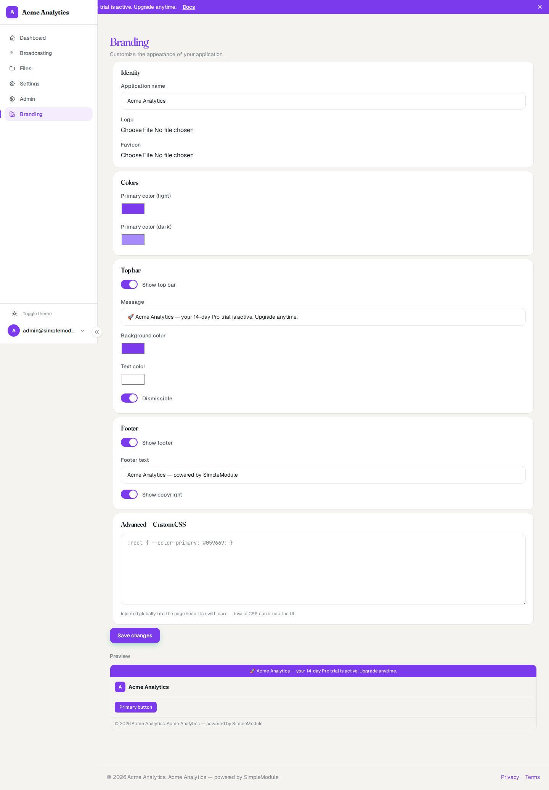

# Branding module — screenshots

The Branding module lets an administrator customize the appearance of a
SimpleModule application from a single global configuration at
`/branding/manage`. Colors, custom CSS, and the favicon are injected into the
document `<head>` server-side (no flash), while the app name, logo, top bar, and
footer reach the client as Inertia shared props.

## Branding applied across the app

Custom top bar (message + link + dismiss), brand mark and app name, primary
color applied to navigation, headings, and buttons, plus the custom footer.

## Admin configuration page

Identity (app name, logo, favicon), colors, top bar, footer, and advanced
custom CSS — with a live preview panel.

